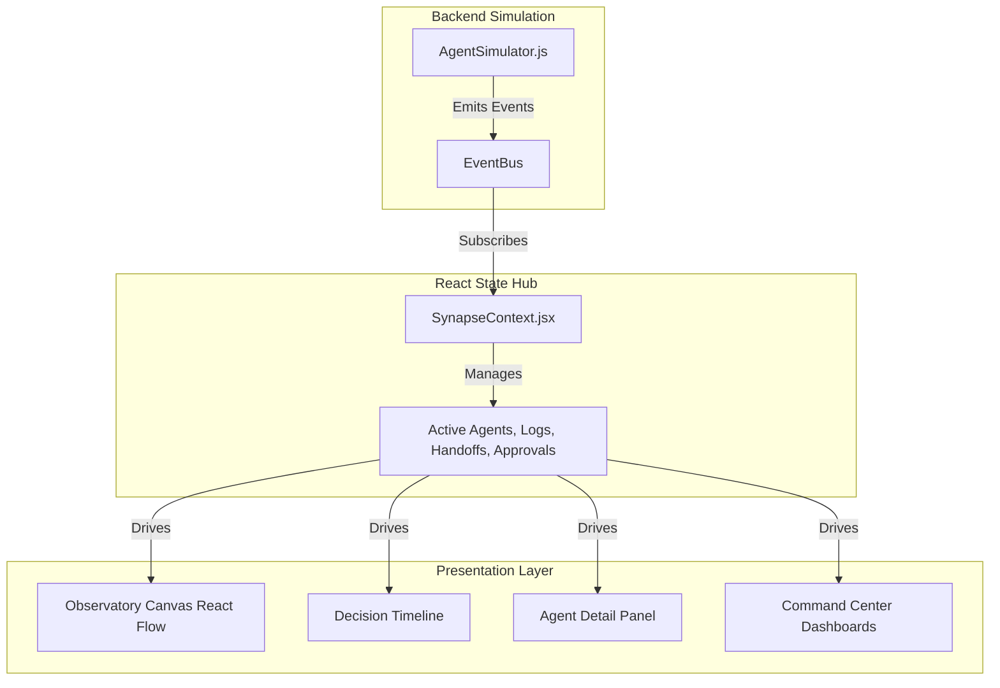

# Synapse Observatory — Product Detail

> [!NOTE]
> **Synapse Observatory** is a next-generation visibility and governance platform designed for the era of autonomous multi-agent systems.

## 1. What It Is
Synapse Observatory is the "Datadog for AI Agents." It is a real-time monitoring, debugging, and governance platform that gives enterprises complete visibility into what their autonomous AI agent swarms are doing. 

As companies move from single-agent chatbots to complex, multi-agent workflows (where agents communicate, negotiate, and delegate tasks to each other), the biggest barrier to enterprise adoption is a "black box" problem. Synapse Observatory cracks open this black box, providing a glass-pane view into agent topologies, communication streams, and decision-making logic.

## 2. What It Does
Synapse Observatory provides a comprehensive suite of tools to monitor and control AI agents:

- **Real-Time Topology Mapping**: Visualizes the entire agent swarm on a dynamic canvas.
- **Inter-Agent Communication Tracing**: Shows exactly when and why one agent hands off work to another, with animated edge connections highlighting data flow.
- **Cost & Token Tracking**: Tracks the granular cost (actions/tokens) of individual micro-agents in real-time.
- **Activity & Decision Logging**: Captures chronological, terminal-style logs of the internal thought processes and actions taken by each agent.
- **Human-in-the-Loop (HITL) Governance**: Pauses autonomous execution when critical thresholds (e.g., high budget approvals) are reached, requiring human sign-off before proceeding.
- **Scenario Replay & Timelines**: Generates horizontal execution timelines to break down how a complex scenario (e.g., self-healing supply chain) was resolved step-by-step.

## 3. How It Is Different
The current AI market is heavily saturated with **Agent Frameworks** (e.g., LangChain, AutoGen, CrewAI) and **Agent Builders** (e.g., Flowise, Voiceflow). 

**Synapse Observatory does not compete in the crowded "builder" space.** 

> [!TIP]
> **The Differentiation:** Instead of helping you *build* an agent, Synapse helps you *trust* the agents you've already built. 

- **Agnostic Layer**: It is designed to sit on top of any backend agent framework as an observability layer.
- **Focus on Governance**: While others focus on making agents smarter, Synapse focuses on making them accountable, traceable, and safe for enterprise deployment.
- **Consumer-Grade UX for Enterprise**: It utilizes a premium, glassmorphic design system with micro-animations that turn abstract code logs into an intuitive, physical-feeling command center.

## 4. How It Works (Technical Architecture)

Synapse Observatory is built as a highly responsive, event-driven frontend application. 

### The Core Engine: `AgentSimulator.js`
At the heart of the demo is a custom-built, event-driven state machine. It simulates a complex backend agent orchestration system without requiring heavy API dependencies.
- It manages an internal state of inventory, pricing, and active agents.
- It emits specific events via a custom EventBus (`activity`, `agent-status`, `agent-handoff`, `approval-added`).
- It executes predefined, highly complex business scenarios (e.g., "Invoice OCR Processing", "Self-Healing Supply Chain") using asynchronous delays to mimic LLM inference times.

### The Visualization Layer: `Observatory.jsx` (React Flow)
The visual representation is powered by React Flow, heavily customized with CSS modules.
- **Nodes**: Custom React components representing agents. They react to state changes (e.g., a glowing pulse animation triggers when status switches to `PROCESSING`).
- **Edges**: Connections between nodes that are dynamically activated by listening to `agent-handoff` events.
- **Context API (`SynapseContext.jsx`)**: Acts as the centralized bridge. It subscribes to the `AgentSimulator` events and broadcasts them to the UI components (Canvas, Timeline, Command Center).

## 5. Use Case Scenarios

The platform currently ships with three demonstration scenarios that prove its enterprise value:

1. **Invoice OCR Processing**
   - *Flow*: `Inventory` → `Procurement` → `Finance`
   - *Value*: Shows how agents handle mundane data entry, triggering alerts only when stock drops below thresholds or budgets require approval.
2. **WhatsApp Custom Order**
   - *Flow*: `Pricing` → `Inventory` → `Logistics`
   - *Value*: Demonstrates omnichannel ingestion, where an unstructured customer request is routed, priced, and scheduled by a swarm of specialized agents.
3. **Self-Healing Supply Chain**
   - *Flow*: External API Alert → `Logistics` → `Pricing` → `Inventory` → `Procurement`
   - *Value*: The flagship demo. A weather API detects a cyclone on a shipping route. Agents autonomously calculate the delay, adjust dynamic pricing for affected SKUs, reserve safety stock, and reroute shipments via a backup supplier — completely autonomously.

## 6. The "Hackathon Winning" Pitch
If presenting this at a hackathon, the core narrative should be:

> *"Everyone here is building AI agents. But if an enterprise deploys an agent swarm that hallucinates, spends $10,000, and breaks a supply chain — who is responsible? You can't deploy what you can't observe. We built Synapse Observatory, the mission control for autonomous agents. We don't build the agents; we provide the observability and governance layer that makes deploying them safe, trackable, and enterprise-ready."*
